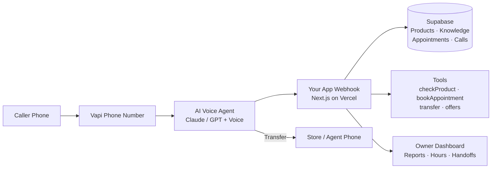

# AI Call Assistant — Client Pitch Deck Content
**Product:** Nexcraft Tech — AI Receptionist / AI Call Assistant  
**Live demo:** https://aicallassistant.vercel.app/  
**Demo number (US):** +1 (346) 359-1699  

Use each section below as one PPT slide (or split where noted).

---

## Slide 1 — Title
**Never Miss a Customer Call Again**  
AI Phone Receptionist for modern businesses  

Nexcraft Tech · AI Call Assistant  
24/7 · Multilingual · Your brand · Your data  

---

## Slide 2 — The Problem
- Missed calls = lost sales (after hours, lunch, busy periods)
- Hiring full-time receptionists is expensive and hard to scale
- Generic IVR (“press 1…”) frustrates customers
- Shared virtual receptionist services are costly per call and not fully yours
- No control over product knowledge, pricing rules, or local showroom hours

**Client pain (example — Living Fire style):** luxury retail / showrooms need warm, product-aware answering + visit booking without a full front desk 24/7.

---

## Slide 3 — The Solution
**Your own AI receptionist** that:
1. Answers inbound calls in a natural voice  
2. Knows *your* products, prices, FAQs, hours  
3. Books showroom / appointment visits  
4. Applies discount rules within limits you set  
5. Transfers to your team (or gives the number if bridge fails)  
6. Logs transcripts, summaries, and transfer context in your dashboard  

Demo: https://aicallassistant.vercel.app/

---

## Slide 4 — Who It’s For (Use Cases)

| Industry | Use cases |
|---|---|
| **Retail / showrooms** (fireplaces, furniture, auto, jewellery) | Product Q&A, pricing, visit booking, transfer to sales |
| **Clinics / wellness** | Hours, services, appointment intake, escalate to staff |
| **Home services** (HVAC, plumbing, solar) | Emergency vs booking, service area, callback |
| **Real estate / agencies** | Property FAQ, schedule viewing, route to agent |
| **Hotels / hospitality** | Reservations info, amenities, transfer to front desk |
| **Multi-location brands** | Per-store hours, closures, department routing |
| **Export / B2B** | Multilingual callers (EN / IT / TA / HI / auto-detect) |

**Best fit:** businesses that lose revenue when phones go unanswered and want **brand-controlled** AI, not a shared call centre.

---

## Slide 5 — Architecture (diagram)

**Stack:** Next.js · Supabase · Vapi (voice) · Claude / LLM · Voyage (optional RAG) · Vercel  

---

## Slide 6 — What Happens on a Call
1. Customer dials your number  
2. AI greets in your brand voice  
3. Looks up products / knowledge / availability from **your database**  
4. Books appointment or quotes within min-price rules  
5. If needed → transfer to human **on the same call**, or give the number  
6. After call → transcript + plain-text summary in dashboard  

---

## Slide 7 — Key Features
- 24/7 inbound answering  
- Product catalog + knowledge base (RAG-ready)  
- Appointment scheduling with weekly capacity  
- Leave / emergency closures (AI explains & offers other dates)  
- Offer / negotiation rules with floor prices  
- Transfer handoffs log (caller ID, time, reason, status)  
- Call reports (volume, duration, transfer rate)  
- Voice / gender + language (auto-detect, English, Italian, …)  
- Dark mode dashboard  

---

## Slide 8 — How Clients Save Money

| Cost item | Traditional | With AI Call Assistant |
|---|---|---|
| Full-time receptionist | ~$3,500–$5,500+/mo (AU/US loaded) | Not required for first-line answering |
| After-hours answering service | High per-call / per-minute | AI covers nights & weekends |
| Missed-call lost sales | Invisible but large | Calls answered → more bookings |
| Training new staff on catalog | Weeks | Update dashboard in minutes |
| Multi-language hire | Expensive | Auto-detect / Italian / Tamil / Hindi |

**Illustrative ROI:**  
If one missed call/week would have become a $2,000 sale → ~$8,000/mo risk.  
AI plan at a few hundred $/mo pays for itself with **1–2 recovered opportunities**.

---

## Slide 9 — Pricing Proposal (Nexcraft / You)

*Suggested commercial packaging — adjust for market (AU/IN/US). Currency shown in USD for comparison; quote AUD for Living Fire.*

### One-time setup
| Package | What’s included | Suggested price |
|---|---|---|
| **Starter Setup** | Assistant config, 1 number, products/knowledge load, dashboard training | **$499 – $999** |
| **Growth Setup** | + multi-location hours, appointments, closures, transfer agents, custom voice | **$1,499 – $2,499** |
| **Enterprise Setup** | + Twilio/AU number, warm transfer, CRM/calendar integrations, custom flows | **$3,500 – $7,500+** |

### Monthly retainer (software + managed ops)
| Plan | Included | Suggested price |
|---|---|---|
| **Starter** | Up to ~100 AI-answered calls*, dashboard, email support | **$149 – $249 / mo** |
| **Business** | Up to ~300 calls*, appointments, reports, priority support | **$349 – $499 / mo** |
| **Scale** | 500+ calls*, multi-location, SLA, quarterly prompt tuning | **$799 – $1,299 / mo** |

\*Plus **pass-through** telephony/AI usage (Vapi + LLM), typically **$0.10–$0.40 per minute** depending on voice/model — billed at cost + small margin, or included with a fair-use cap.

### Optional add-ons
- Extra phone number: $10–25/mo  
- Warm transfer + AU Twilio trunk: quote  
- Google Calendar sync: $49–99/mo  
- Custom CRM webhook: setup fee  

---

## Slide 10 — vs Smith.ai (Differentiation)

Sources: [Smith.ai AI Receptionist pricing](https://smith.ai/pricing/ai-receptionist), [Smith.ai virtual receptionists](https://smith.ai/pricing/receptionists)

| | **Smith.ai** | **Nexcraft AI Call Assistant** |
|---|---|---|
| Model | SaaS / shared platform | **Your branded product** built & managed for you |
| AI Receptionist | Free–$150–$500+/mo by call packs (~$1.67–$3/call) | Flat retainer + transparent usage |
| Human VR | From ~**$300/mo** for 30 calls (+ overages/add-ons) | Human only when *you* transfer to *your* staff |
| Product knowledge | Their workflows | **Your DB** — products, min prices, offers |
| Appointments / closures | Add-ons / their UI | Built-in showroom scheduling + emergency closures |
| Data ownership | On their platform | **Your Supabase + dashboard** |
| Customization | Limited to their product | Roadmap you control (CRM, AU SIP, etc.) |
| White-label | No (their brand) | Yes — Nexcraft / client brand |

**Positioning line:**  
*Smith.ai is a great off-the-shelf service. We build **your** receptionist — your catalog, your rules, your dashboard, your margins — usually at a lower effective cost for mid-volume showrooms and multi-location brands.*

**Affordability angle (example 100 calls/mo):**  
- Smith.ai AI Pro-style: often **$150–$270+**/mo for call packs  
- Smith.ai human VR: **$300+**/mo for only 30 calls  
- Nexcraft Business: **~$349–$499**/mo all-in style retainer with **your** knowledge + appointments — or Starter **~$149–$249** for lighter volume  

*(Always show a custom quote; usage varies by call length.)*

---

## Slide 11 — Cost Transparency (what drives usage)
Per answered minute roughly includes:
- Voice (TTS/STT)  
- LLM tokens  
- Telephony  

**Ways we keep client cost down:**
- Use **Haiku**-class models for speed/cost  
- Short, guided conversations  
- Transfer early when needed (AI minutes stop after successful bridge)  
- Keyword search first; Voyage RAG optional  

---

## Slide 12 — Security & Control
- Auth via Supabase  
- Webhook secret for Vapi  
- Row-level data per business  
- Owner can clear data or delete business (Settings → Danger Zone)  
- Transcripts & summaries stored for QA / training  

---

## Slide 13 — Roadmap (sell the partnership)
- Warm transfer with full context (Twilio / AU numbers)  
- SMS handoff pack to staff on transfer  
- Google Calendar sync  
- WhatsApp / email summaries  
- Outbound reminder calls  
- Multi-business agency portal  

---

## Slide 14 — Live Demo Script
1. Open dashboard → show products, hours, appointments  
2. Call +1 (346) 359-1699  
3. Ask: gas fireplaces? Richmond hours? Book a visit?  
4. Ask: transfer to human → show **Transfers** tab (caller ID + time)  
5. Show **Calls** transcript + summary  
6. Toggle dark mode / language  

---

## Slide 15 — Ask / Next Step
**Proposal:**  
- Setup: **$___** (Growth recommended for Living Fire-class)  
- Monthly: **$___** Business plan  
- Pilot: 30 days, success = X answered calls + Y booked visits  

**Contact:** Nexcraft Tech  
Demo: https://aicallassistant.vercel.app/

---

## Appendix — One-pager talk track
“We give you an AI front desk that sounds human, knows your catalogue, books visits against your real hours—including emergency closures—and hands off to your team with context. Unlike Smith.ai, it’s **your system**: your data, your rules, your brand—and priced as a partnership, not a per-call call centre.”
